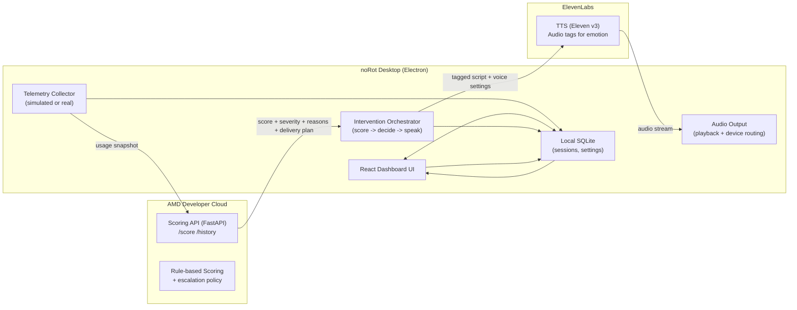

# noRot

> IMPORTANT: Do not modify this file. This document is the constitution of the whole app.
> If any code or behavior disobeys this architecture, deal with it by fixing the implementation properly (not by editing this document).
AI-powered procrastination interrupter for Hack for Humanity 2026

## One-liner
noRot is a cross-platform (macOS + Windows) desktop companion that detects procrastination patterns in real time and intervenes with an ElevenLabs voice that escalates in urgency and emotional tone the longer you keep procrastinating.

## What “the voice raises as you procrastinate” means
noRot uses **progressive escalation**, not just louder audio.

- **Score increases** as procrastination signals accumulate.
- **Severity level steps up** (0 to 4).
- Each step increases:
  - **Tone intensity** (warm → firm → annoyed → angry)
  - **Directness** (gentle suggestion → clear instruction)
  - Optional **pace** increase (slightly faster at severity 2 to 3)
- Ignoring noRot (snooze, dismiss, keep doom-scrolling) adds **escalation pressure** so the next intervention is stronger.

This makes the demo instantly legible: procrastinate more, the voice gets more intense.

## Differentiators (so it does not look like “just another productivity app”)
- **Escalation mechanic is the product**: the same voice evolves emotionally as your procrastination worsens.
- **Explainable scoring**: rule-based, defendable in judge Q&A.
- **Local-first ethics**: no content inspection, no keylogging, user-controlled thresholds.
- **Crisis-aware**: severity 4 is supportive and calm, not angry.

## Goals
- Feel like an ally (human voice), not parental control.
- Same UX on **macOS and Windows**.
- Hackathon-friendly end-to-end loop: simulate doom-scroll, watch score rise, trigger voice, update dashboard.
- Demo reliability: always have a fallback path if cloud or ElevenLabs is flaky.

## Non-goals (scope control)
- Full OS-level app blocking.
- Deep content inspection.
- Accounts and multi-device sync.

---

# Tech stack (current as of Feb 2026)

## Desktop app (macOS + Windows)
- **Electron 40.6.x**
- **Node.js 24.13.x (LTS)** toolchain for dev
- **React 19.2.x** + **TypeScript 5.9.x**
- **Vite 7.3.x**
- **Tailwind CSS 4.2.x**
- State:
  - **TanStack Query** (server state)
  - **Zustand** (local UI state)
- Charts: **Recharts** (simple) or **ECharts** (richer)
- Local persistence: **SQLite** via `better-sqlite3` (recommended for Electron)

## Backend scoring API (AMD Developer Cloud)
- **Python 3.14.3**
- **FastAPI 0.129.x** + **Pydantic v2**
- **Uvicorn** (dev) and `gunicorn -k uvicorn.workers.UvicornWorker` (prod)
- Persistence:
  - Hackathon mode: SQLite or in-memory
  - Later: Postgres

## Voice
- Primary: **ElevenLabs TTS using Eleven v3** (for emotional control via audio tags)
- Optional: **ElevenLabs Agents** for more dynamic conversation
- Demo insurance: **pre-generated local MP3 fallback** per severity and persona

---

# High-level architecture



---

# Component breakdown

## 1) noRot Desktop (Electron)

### Responsibilities
- Collect activity signals (simulated or real).
- Render the dashboard (usage patterns, procrastination score, timeline).
- Trigger and play voice interventions with escalation.
- Store session history locally so the demo works even if the network is flaky.

### Subsystems

#### A. Telemetry Collector
Two modes behind a feature flag.

1. **Hackathon mode (default)**
   - Buttons/presets like:
     - “Doom-scroll 10 min”
     - “Late-night spiral”
     - “Focused work session”
     - “Snooze twice”
   - Produces deterministic data so you can reliably hit severity thresholds in a demo.

2. **Real telemetry (optional, only if you have time)**
   - Active window/app name and duration
   - App-switch frequency (count switches per minute)
   - Idle time (mouse/keyboard inactivity)

All data is normalized into a `UsageSnapshot` every N seconds (example: 5s).

#### B. Intervention Orchestrator
- Calls `/score` with the current `UsageSnapshot` plus minimal recent history context.
- Receives:
  - `procrastinationScore` (0 to 100)
  - `severity` (0 to 4)
  - `reasons` (bullet list for explainability)
  - `recommendation` (mode, persona, tagged script, cooldown)
- Triggers voice via ElevenLabs.
- Writes an `InterventionEvent` to the local DB and notifies the UI.

Reliability improvement (low effort): if the API call fails, compute a **local fallback score** using the same weights and keep the demo running.

#### C. Audio Output
- Plays ElevenLabs audio stream.
- Keeps volume within a safe cap.
- Provides controls:
  - mute
  - snooze
  - “I’m working” (drops severity and extends cooldown)

Important: we do not rely on gain boosts for escalation. Escalation is expressed through tone and wording.

#### D. Local Persistence (SQLite)
Stores:
- telemetry summaries
- interventions and severity history
- user settings (persona, thresholds, cooldowns)

#### E. UI (React Dashboard)
Core widgets:
- Procrastination score gauge (green, yellow, red)
- Usage chart (last 60 minutes)
- Timeline of interventions (what noRot said, when, why)
- Persona selector (calm friend, coach, tough love)

---

## 2) Scoring API (FastAPI on AMD Developer Cloud)

### Responsibilities
- Convert usage snapshots into an interpretable score.
- Apply escalation policy and return a recommended intervention plan.
- Provide history and correlation metrics to power the dashboard.

### Suggested endpoints
- `POST /score`
  - Input: `UsageSnapshot` + minimal recent context
  - Output: score, severity, reasons, recommended tagged script and voice settings
- `GET /history?limit=...`
  - Output: recent session summaries for charts

FastAPI auto-generates OpenAPI docs, which is a quick win for collaboration and debugging.

---

## 3) ElevenLabs voice escalation (tone, not volume)

### Key idea
Use **Eleven v3 audio tags** to control emotion. noRot prepends a tag based on severity.

Example mapping:

| Severity | Score band | Emotional tone | Audio tag | Mode |
|---|---:|---|---|---|
| 0 | 0-24 | silent | (none) | none |
| 1 | 25-49 | warm, helpful | `[thoughtful]` or `[calm]` | nudge |
| 2 | 50-69 | firm | `[annoyed]` | remind |
| 3 | 70-89 | angry, interrupting | `[angry]` | interrupt |
| 4 | 90-100 | calm, supportive | `[thoughtful]` or `[sad]` | crisis |

### Voice settings (simple, low-effort tuning)
- Keep a single voice per persona for consistency.
- Adjust per severity:
  - **stability**: lower at severity 2 to 3 to allow a broader emotional range
  - **speed**: slightly faster at severity 2 to 3
  - Keep volume stable (safe cap)

### Fallback audio clips (demo insurance)
Pre-generate MP3s for each persona and severity using the same tags. If ElevenLabs calls fail, play local audio and keep the experience identical.

---

# Data contracts

## UsageSnapshot (desktop -> backend)
```json
{
  "timestamp": "2026-02-28T20:15:00Z",
  "focusIntent": {
    "label": "Finish essay outline",
    "minutesRemaining": 22
  },
  "signals": {
    "sessionMinutes": 34,
    "distractingMinutes": 27,
    "productiveMinutes": 7,
    "appSwitchesLast5Min": 18,
    "idleSecondsLast5Min": 40,
    "timeOfDayLocal": "22:15",
    "snoozesLast60Min": 2
  },
  "categories": {
    "activeApp": "Chrome",
    "activeCategory": "social"
  }
}
```

## ScoreResponse (backend -> desktop)
```json
{
  "procrastinationScore": 78,
  "severity": 3,
  "reasons": [
    "High distract ratio (27/34 min)",
    "High app switching (18 in 5 min)",
    "Late-night multiplier applied"
  ],
  "recommendation": {
    "mode": "interrupt",
    "persona": "tough_love",
    "text": "[angry] Stop. Two minutes. Stand up. Water. Then back to the outline.",
    "tts": {
      "model": "eleven_v3",
      "stability": 35,
      "speed": 1.08
    },
    "cooldownSeconds": 180
  }
}
```

---

# Scoring and escalation design

## Procrastination score (0 to 100)
Simple, explainable weighted score.

Signals:
- `distractRatio = distractingMinutes / sessionMinutes`
- `switchRate = appSwitchesLast5Min / 5`
- `lateNight = 1 if localTime in [23:00..05:00] else 0`
- `intentGap = 1 if focusIntent exists and activeCategory is social/entertainment else 0`
- `snoozePressure = min(snoozesLast60Min, 3) / 3`

Example formula (tune weights live during hacking):
- `base = 100 * (0.55*distractRatio + 0.30*normSwitchRate + 0.00*intentGap + 0.15*snoozePressure)`
- `lateNightMultiplier = 1.25 if lateNight else 1.0`
- `score = clamp(base * lateNightMultiplier, 0, 100)`

`normSwitchRate` can be normalized such that 0-4 switches/min = low, 5-10 = medium, 11+ = high.

## Escalation pressure
Each snooze adds temporary pressure:
- +5 score for the next 10 minutes, capped.

Guardrail: never escalate into insults or shame language.

---

# Cross-platform notes (macOS + Windows)

## Packaging
- Use `electron-builder` or `electron-forge` to produce:
  - macOS: `dmg` (arm64 and x64 as needed)
  - Windows: `exe` or `msi` (x64)
- Keep a “demo mode” flag so judges can run it quickly without OS permission prompts.

## OS permissions and UX
- macOS may require permissions for certain telemetry methods.
- Windows can trigger antivirus heuristics if you use aggressive global hooks.
- For hackathon: keep real telemetry optional and focus on the simulated demo loop.

---

# Security and privacy baseline
- Default to **local storage**.
- Never record raw keystrokes.
- Store API keys in OS keychain if possible. For hackathon demo, env vars are fine.
- Disclose exactly what signals are collected (app name, duration, switches) and what is not (content).

---

# Repo layout (suggested)
```
/apps
  /desktop         # Electron + React
  /api             # FastAPI scoring service
/packages
  /shared          # Shared types and constants
```

---

# MVP checklist

Must-have:
- Desktop app launches on macOS and Windows (at least one packaged build for demo)
- Simulated procrastination scenario drives `/score`
- Score crosses threshold and triggers ElevenLabs speech
- UI shows live score and a usage chart
- Local MP3 fallback exists for at least severity 1 to 3

Nice-to-have:
- Persona switcher (3 voices)
- Crisis escalation flow and resources card
- Real telemetry plugin (active app + switch count)

Cut if behind:
- Browser extension
- Account system
- Persistent cloud database
